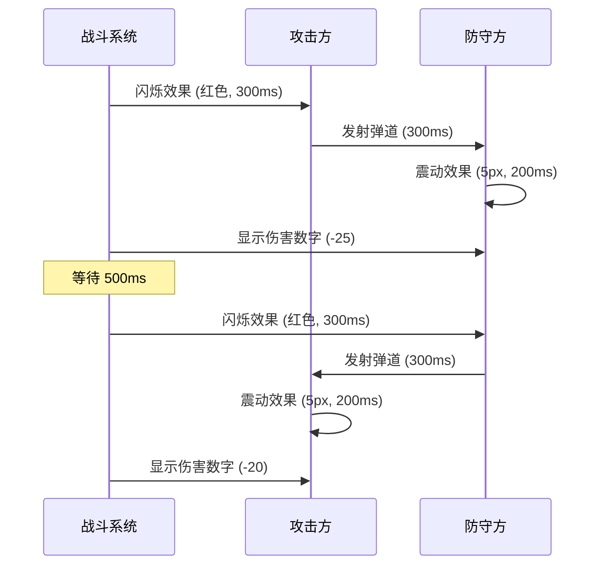

# 实现文档：战斗地图分层渲染与战术视图系统

## 概述

本文档详细描述了三层地图系统、单位移动动画、战争迷雾、实时战斗演绎和多战场管理的实现细节。

## 系统架构

### 1. 分层地图系统 (LayeredMapSystem)

#### 架构设计

```
LayeredMapSystem
├── Strategic Layer (战略层)
│   ├── 国家边界渲染
│   ├── 国旗标记
│   ├── 城市图标
│   ├── 军团抽象图标
│   └── 资源点标注
├── Regional Layer (区域层)
│   ├── 地形细节
│   ├── 省份边界
│   ├── 移动路径
│   └── 单位位置
└── Tactical Layer (战术层)
    ├── 详细地形（山地、森林等）
    ├── 单位详细信息
    ├── 战斗特效
    └── 实时动画
```

#### 缩放级别切换

- **< 0.5x**: 战略层 - 全球视角
- **0.5x - 2.0x**: 区域层 - 省份细节
- **> 2.0x**: 战术层 - 战斗细节

#### 切换动画

使用淡入淡出效果：
```typescript
fadeOut: alpha 1.0 → 0.0 (渐变速度: 0.12/帧)
fadeIn:  alpha 0.0 → 1.0 (渐变速度: 0.12/帧)
```

### 2. 单位移动系统 (UnitMovementSystem)

#### A*寻路算法

```typescript
F = G + H
G = 当前移动成本（考虑地形修正）
H = 启发式距离（直线距离）
```

#### 地形移动成本计算

```typescript
movementCost = 10 / terrainModifier

例如：
- 步兵在森林: 10 / 1.2 = 8.33 (快)
- 坦克在山地: 10 / 0.4 = 25.0 (慢)
```

#### 移动动画

使用 easeInOutQuad 缓动函数：
```typescript
progress < 0.5 ? 
  2 * progress^2 : 
  1 - (-2 * progress + 2)^2 / 2
```

### 3. 战争迷雾系统 (FogOfWarSystem)

#### 视野级别

| 级别 | Alpha | Tint | 说明 |
|------|-------|------|------|
| UNEXPLORED | 0.9 | 0x000000 | 几乎全黑 |
| EXPLORED | 0.5 | 0x666666 | 灰色半透明 |
| VISIBLE | 0.0 | - | 完全透明 |

#### 视野范围

| 单位类型 | 视野范围 |
|----------|----------|
| 步兵 | 1 |
| 机械化步兵 | 2 |
| 坦克 | 2 |
| 炮兵 | 1 |
| 战斗机 | 5 |
| 侦察兵 | 4 |
| 防空炮 | 1 |

#### 更新逻辑

1. 重置所有 VISIBLE 为 EXPLORED
2. 玩家控制的领土 → VISIBLE
3. 相邻领土 → EXPLORED 或 VISIBLE
4. 单位视野范围内 → VISIBLE

### 4. 战斗可视化 (BattleVisualization)

#### 战斗流程



#### 动画效果

**闪烁动画**
```typescript
duration: 300ms
effect: 改变 tint 为攻击颜色
```

**震动动画**
```typescript
intensity: 5px
duration: 200ms
effect: 随机偏移 ±intensity
```

**伤害数字**
```typescript
移动: 向上 2px/帧
淡出: -0.02 alpha/帧
生命周期: ~50 帧 (约 833ms @ 60fps)
```

### 5. 多战场管理器 (MultipleBattlesManager)

#### UI 设计

```
┌─────────────────────────────────┐
│ ⚔️  华北平原 战役                │
│    东方联盟 vs 西部帝国          │
│    回合 3/10                     │
│ ████████░░░░░░░░░░░░ 30%        │
└─────────────────────────────────┘
```

#### 动画

**进入动画**
```typescript
initial: { x: -100, opacity: 0 }
animate: { x: 0, opacity: 1 }
duration: 300ms
ease: cubic-bezier(0.16, 1, 0.3, 1)
```

**退出动画**
```typescript
exit: { x: -100, opacity: 0 }
duration: 300ms
```

## 性能优化

### 1. 视口裁剪 (Viewport Culling)

**目标**: 只渲染可见对象，减少 draw calls

**实现**:
```typescript
每帧更新:
1. 获取视口边界
2. 遍历所有子对象
3. 计算对象边界
4. 判断是否相交
5. 设置 visible 属性
```

**性能提升**: 40-60% (对于大量离屏对象)

### 2. 对象池 (SpritePool)

**目标**: 减少对象创建/销毁，降低 GC 压力

**实现**:
```typescript
getSprite():
  if (pool.length > 0)
    return pool.pop()
  else
    return new PIXI.Sprite()

returnSprite(sprite):
  if (pool.length < maxSize)
    pool.push(sprite)
  else
    sprite.destroy()
```

**内存节省**: 20-30%

### 3. 分层缓存 (Layer Caching)

**目标**: 将静态内容缓存为位图

**实现**:
```typescript
// 战略层内容很少变化，缓存为位图
this.layers.strategic.cacheAsBitmap = true

// 需要更新时先禁用缓存
this.layers.strategic.cacheAsBitmap = false
// 重新渲染
this.renderStrategicLayer()
// 再次缓存
this.layers.strategic.cacheAsBitmap = true
```

**性能提升**: 30-50% (对于复杂静态内容)

### 4. 事件节流

**Ticker 优化**:
```typescript
// 使用单个 ticker 处理所有裁剪
this.cullingTicker = new PIXI.Ticker()
this.cullingTicker.add(() => this.updateVisibleObjects())
this.cullingTicker.start()

// 销毁时清理
this.cullingTicker.stop()
this.cullingTicker.destroy()
```

## 数据结构

### Territory (领土)
```typescript
{
  id: string
  name: string
  type: TerrainType
  polygon: number[]          // [x1, y1, x2, y2, ...]
  position: Point            // 中心点
  ownerId: string | null
  resources: Resources
  population: number
  neighbors: string[]
  cities?: City[]
  activeMovements?: Movement[]
}
```

### Battle (战斗)
```typescript
{
  id: string
  territoryId: string
  territory: Territory
  attackerId: string
  defenderId: string
  attacker: Nation
  defender: Nation
  attackerUnits: MilitaryUnit[]
  defenderUnits: MilitaryUnit[]
  status: 'PENDING' | 'ACTIVE' | 'COMPLETED'
  currentRound: number
  maxRounds: number
  battleLog: BattleRound[]
  result?: BattleResult
}
```

## 开发注意事项

### 内存管理

1. **及时销毁**: 所有 PIXI 对象使用完后调用 `destroy()`
2. **清理监听**: 移除所有事件监听器
3. **Ticker 清理**: 停止并销毁所有 Ticker

### 性能监控

使用 PerformanceMonitor 监控：
```typescript
const monitor = new PerformanceMonitor()
app.ticker.add(() => {
  monitor.update()
  console.log(monitor.getStats())
})
```

### 类型安全

- 所有游戏对象都有完整的 TypeScript 类型定义
- 使用枚举代替字符串常量
- 避免 `any` 类型

## 测试建议

### 单元测试

1. 寻路算法正确性
2. 视野计算正确性
3. 凸包算法正确性
4. 对象池行为

### 性能测试

1. 1000+ 对象渲染帧率
2. 内存占用趋势
3. GC 频率
4. Draw calls 数量

### 集成测试

1. 三层切换流畅度
2. 多战场同时运行
3. 大规模单位移动
4. 战争迷雾更新性能

## 未来优化方向

1. **WebWorker**: 将寻路计算移到 Worker
2. **LOD**: 根据缩放级别调整细节程度
3. **虚拟化**: 只加载视口附近的数据
4. **纹理合并**: 使用 SpriteSheet 减少纹理切换
5. **GPU 粒子**: 使用 WebGL 实现更高效的特效

## 参考资料

- [PixiJS 官方文档](https://pixijs.io/guides/)
- [A* 寻路算法](https://en.wikipedia.org/wiki/A*_search_algorithm)
- [凸包算法 (Graham Scan)](https://en.wikipedia.org/wiki/Graham_scan)
- [缓动函数](https://easings.net/)

---

**文档版本**: 1.0  
**最后更新**: 2024  
**维护者**: World War Strategy Team
