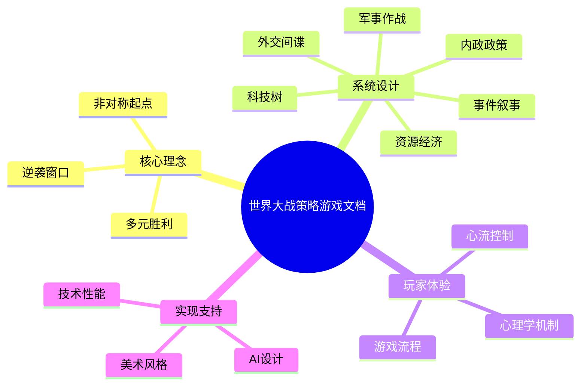

# 世界大战多人策略游戏设计文档总览

## 概述
本套文档聚焦于构建一款4-6人参与的跨平台世界大战多人策略游戏。所有资料围绕核心理念、系统、心理学机制、AI与技术实现展开，形成开发团队可直接执行的蓝图。整体规划遵循三阶段目标：

- **短期交付（≤30天）**：完成原型的核心循环（资源采集→回合处理→战斗解析），保障 80% 的基础系统可交互。
- **中期交付（31-90天）**：实现完整的外交、间谍、意识形态系统及跨平台优化，达成 60FPS（PC）/30FPS（移动）稳定帧率。
- **长期交付（>90天）**：上线心理学机制、完整事件叙事与AI人格多样化，确保留存率目标 DAU 次日留存 ≥ 45%。

## 文档结构索引

| 编号 | 文档名 | 说明 | 关键输出 |
| --- | --- | --- | --- |
| 00 | 目录 | 当前概览与导航 | 阶段目标、思维导图 |
| 01 | 核心理念 | 设计哲学与体验目标 | 非对称、公平与逆袭框架 |
| 02 | 系统设计-经济 | 资源与经济循环 | 资源配比、发展路径 |
| 03 | 系统设计-科技 | 科技树与突破机制 | 科技分支、逆袭窗口 |
| 04 | 系统设计-军事 | 兵种、补给与战场 | 兵种克制、战斗节奏 |
| 05 | 系统设计-外交 | 外交、联盟与间谍 | 关系矩阵、决策窗口 |
| 06 | 系统设计-内政 | 政体、政策与稳定度 | 政策数值、意识形态 |
| 07 | 事件与叙事 | 随机事件与叙事线 | 事件触发、叙事模板 |
| 08 | 心理学机制 | 12项心理学驱动 | 奖励循环、FOMO |
| 09 | 游戏流程 | 阶段节奏规划 | 模式时间轴、关键节点 |
| 10 | AI设计 | AI架构与行为 | 分层规划、难度调控 |
| 11 | 技术需求 | 性能、网络与前端 | 资源预算、跨平台策略 |
| 12 | 美术风格 | 视觉与叙事风格 | 艺术基调、表现手法 |

## 关键数值建议
- **内容更新节奏**：每 4 周推出一次主题事件或限定科技包，维持活跃度。
- **文档复审频率**：每 14 天进行一次跨部门评审，确保与实现进度匹配。
- **里程碑考核指标**：核心玩法上线后，目标平均对局时长 75 分钟、标准模式完成率 ≥ 55%。

## 心理学考量
- 提供清晰的学习路径与阶段性奖励，缓解信息过载并建立成就感。
- 保持文档可浏览性和索引清晰度，降低团队成员的认知负担，提升协作效率。
- 在目录中预先暗示“逆袭”“核威慑”“联盟背叛”等高张力主题，激发期待与探索动机。

## 实现优先级
1. **P0**：确保 01-10 文档内容满足系统开发所需的输入（与程序、策划同步落地）。
2. **P1**：11-12 文档在艺术与性能评审前完成，保障资产制作与技术路线的提前准备。
3. **P2**：定期更新目录、评审记录与里程碑，形成持续可追踪的知识库。

## 文档思维导图

