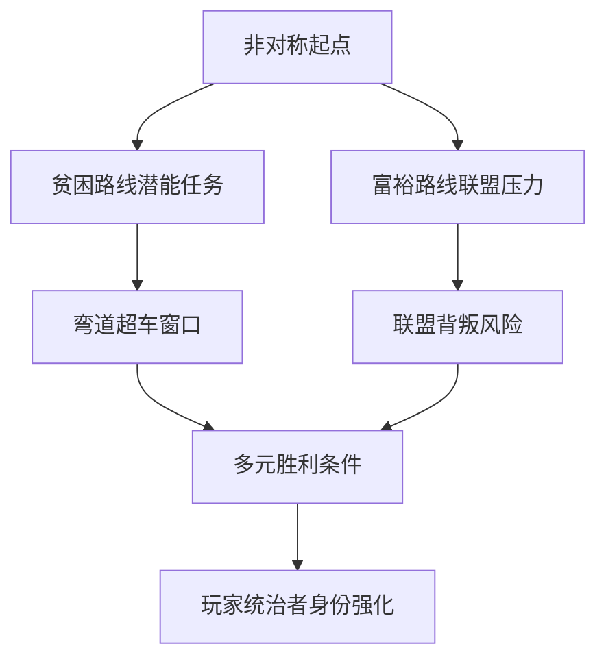

# 核心理念

## 概述
本作以“非对称起点、贫困崛起、动态世界大战”为核心体验。玩家扮演国家统治者，通过资源调配、外交博弈与军事抉择，在多变的局势中塑造世界秩序。设计目标强调策略深度、逆袭快感与长期留存。

## 核心机制详述
1. **非对称起点**：
   - 初始资源差距控制在 ±65% 以内，贫困国家初始 GDP 为富裕国家的 35%。
   - 不同洲区拥有专属地形与战略资源，迫使玩家因地制宜。
2. **逆袭路径**：
   - 贫困国家可在第 4-6 回合解锁“潜能规划”链任务，提供 +25% 研发效率的限时增益（持续 3 回合）。
   - “弯道超车事件”每局平均触发 2.5 次，为弱势国家提供重大突破节点。
3. **世界大战动态**：
   - 世界局势分为稳定、紧张、全面战争三个阶段；全球威胁值每 10 分钟评估一次。
   - 联盟人数上限根据阶段从 2 人 → 3 人 → 4 人递增。
4. **多元胜利条件**：
   - 军事：直接占领世界 75% 领土或击溃所有敌对核心城市。
   - 外交：联合国投票支持率 ≥ 68% 且维持 3 回合。
   - 经济：全球贸易总额占比 ≥ 55% 且国家信用评级 AAA。
   - 科技：科技领先 5 层以上并拥有核威慑满值。
   - 意识形态：影响力值覆盖 60% 世界人口。
5. **统治者身份强化**：
   - 玩家决策直接影响国民满意度、军队忠诚与国际声誉。
   - 允许通过政体改革塑造国家风格：科技共和国、军工帝国、贸易联盟等分支。

## 数值建议
- 基础资源刷新率：贫困国家 6 单位/回合，富裕国家 10 单位/回合，通过科技与政策上限可增至 18 单位/回合。
- 国家稳定度满分 100，低于 35 触发动荡事件，高于 80 获得 +5% 生产效率加成。
- 弯道超车窗口出现概率：处于全球排名倒数 2 的国家在满足条件时 40% 触发，其余国家 12%。
- 核心事件间隔：平均每 8 分钟出现一次，不低于 5 分钟。

## 心理学考量
- **自我效能感**：通过可视化成长曲线和阶段性任务，让贫困玩家感知进步。
- **社会比较**：排行榜与战报突出逆袭案例，激发竞争与羡慕心理。
- **控制感**：多元胜利路径让玩家根据偏好制定策略，降低无力感。
- **风险回报**：弯道超车机制提供明确的高风险高回报选择，满足冒险动机。

## 实现优先级
1. **P0**：建立非对称起点配置、胜利条件检测、逆袭事件框架。
2. **P1**：实现动态世界状态与联盟/威胁值系统联动。
3. **P2**：强化统治者演化（政体树、国家风格）与叙事反馈。

## 关联图表

