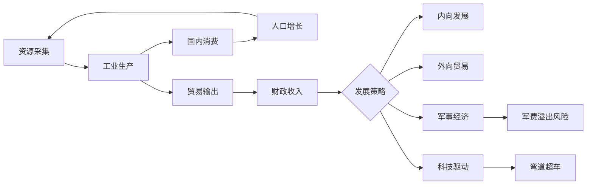

# 系统设计：资源与经济

## 概述
经济系统是游戏的基石，涵盖资源采集、工业生产、贸易和宏观调控。设计目标是让玩家在资源稀缺与增长潜力之间做出取舍，体现贫困国家的艰辛与潜在爆发力。

## 核心机制
1. **资源层级**：
   - 基础资源：食物、木材、矿石、能源、人口。
   - 战略资源：橡胶、稀有金属、石油、铀。
   - 特殊资源：文化遗产、稀缺文物，用于外交与意识形态。
2. **产出与消耗**：
   - 每座城市可建造 3 类产业区：农业、工业、能源，每区每回合产出基础资源 4~12 单位。
   - 战略资源通过专属采集点与国际贸易获得，每回合产出 1~3 单位。
3. **贫困地区特色**：
   - 初始生产效率 -30%，运输效率 -25%。
   - 隐藏资源点密度是富裕地区的 1.8 倍，需投入 200 资金进行勘探。
   - 潜在劳动力加成：实施“义务教育”政策后人口可转化为 1.2 倍劳动力。
4. **经济发展路径**：
   - 内向发展：优先保障食物和稳定，3 回合内完成基础设施升级。
   - 外向型经济：通过贸易港口获得 +20% 贸易收入，但受国际市场波动 ±15%。
   - 军事经济：军工投资比重 ≥ 45% 时触发军费溢出，民生满意度 -10。
   - 科技驱动：科研支出比重 ≥ 25% 时触发科技突破概率 +12%。
5. **市场与贸易**：
   - 全球市场每 5 回合刷新行情，对基础资源价格波动 ±10%，战略资源 ±20%。
   - 玩家可设定最高关税（0%~25%），影响贸易伙伴亲密度。

## 数值建议
- 食物维持人口消耗：每 10 万人口需要 2 单位食物/回合。
- 工业区建设成本：贫困国家 120 资金，富裕国家 160 资金；升级成本依次为 180/240。
- 物流配额：默认每回合可跨洲运输 40 单位资源，科技提升后最高 90 单位。
- 通胀机制：货币供给增长率与 GDP 增长率差距超过 15% 时触发通胀事件。
- 资源储备阈值：食物储备 < 5 回合将触发饥荒预警，> 12 回合获得稳定度 +5。

## 心理学考量
- **损失厌恶**：资源短缺通过红色警报与民众抗议强化负面反馈，促使玩家调整策略。
- **渐进式奖励**：基础设施升级提供即时产能提升与动画反馈，强化“投入—产出”的正循环。
- **逆境满足**：贫困国家解锁隐藏资源点时播放特殊演出，增强逆袭快感。
- **FOMO**：全球市场限时折扣与稀缺资源竞价提供紧迫感。

## 实现优先级
1. **P0**：资源采集、消耗表与基础产业区框架。
2. **P0**：物流与市场价格公式，实现基本贸易功能。
3. **P1**：贫困特色机制（隐藏资源、劳动力转化）。
4. **P1**：事件化的通胀与饥荒系统。
5. **P2**：文化遗产等特殊资源与动态贸易协定。

## 经济循环图

