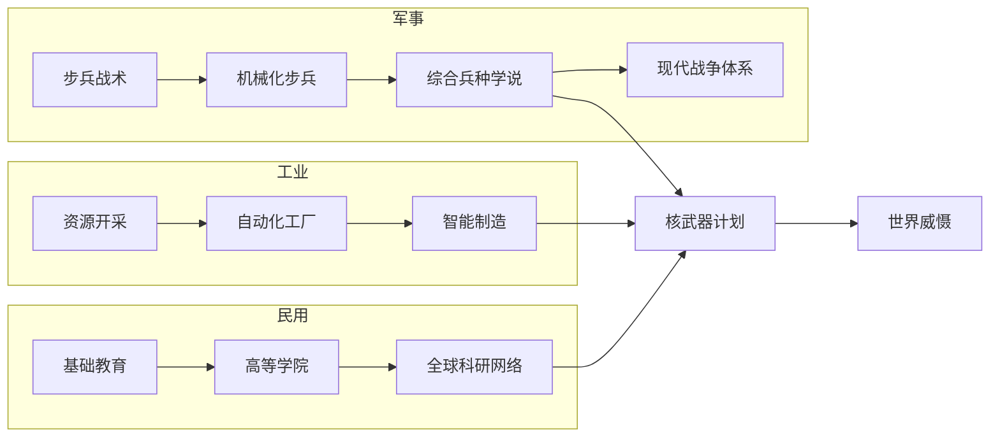

# 系统设计：科技与研发

## 概述
科技系统通过多分支科技树塑造各国战略差异。玩家需要权衡研发速度、资源投入与战略方向，以实现“弯道超车”或全面领先。科技同经济、军事、外交等系统深度交织。

## 科技树结构
1. **军事科技**：步兵、装甲、海军、空军、核武器五大分支；每分支 6 层。
2. **工业科技**：生产效率、资源开采、自动化、物流四个模块；共 5 层。
3. **农业科技**：灌溉、机械化、种子改良、粮储管理；共 4 层。
4. **民用科技**：医疗、教育、交通、通讯；共 5 层。
5. **意识形态科技**：凝聚力、宣传、外交影响、革命输出；共 4 层。

科技点来源包括：基础研究机构（每回合 5 点）、高校系统（每回合 3 点）、事件奖励、外交协定、间谍窃密。

## 数值建议
- 基础科技成本：第 1 层 40 点，第 2 层 60 点，第 3 层 90 点，第 4 层 130 点，第 5 层 180 点，第 6 层 240 点。
- 贫困国家科研产出：初始每回合 6 点，通过教育投资可在 10 回合内提升至 12 点。
- 技术窃取成功率：基础 35%，投入间谍资产后最高可达 65%，失败将触发 -8 稳定度。
- 科技突破事件：满足“科研投入 ≥ GDP 25%”且连续 3 回合稳定度 ≥ 60 时触发概率 20%。
- 逆向工程：缴获高级装备后 2 回合内完成分析，可获得目标科技层级 50% 进度。

## 心理学考量
- **成长可视化**：科技树 UI 以高亮和动画展示进度，赋予玩家持续投入的动力。
- **不确定性刺激**：科技突破、暴击机制提供惊喜感。
- **控制感**：允许玩家锁定 2 条优先研究路线，并预览潜在收益，减少选择焦虑。
- **风险回报**：间谍窃密与逆向工程提供高风险高收益选择，触发紧张与期待。

## 实现优先级
1. **P0**：科技点生成、消费机制与科技树数据结构。
2. **P0**：军事、工业、农业三大基础分支的前 3 层。
3. **P1**：民用、意识形态科技以及事件化突破系统。
4. **P1**：间谍窃密与逆向工程流程。
5. **P2**：科技暴击演出、成就联动与科技共享协定。

## 科技树示意

