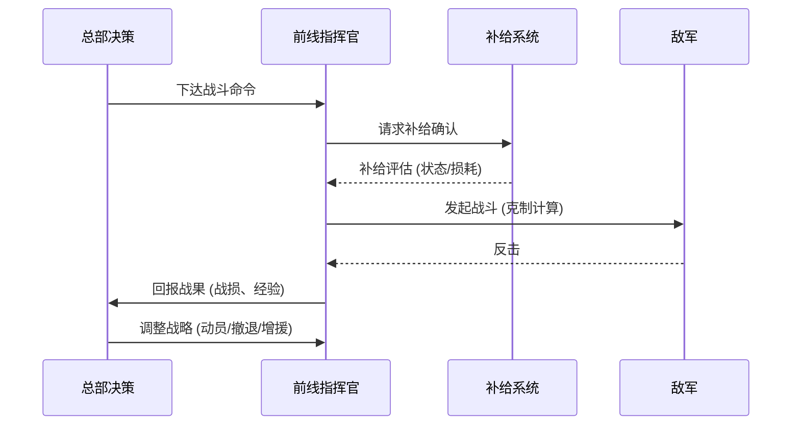

# 系统设计：军事

## 概述
军事系统体现国家力量的直接对抗，涵盖兵种组合、补给、地形与将领。设计强调质量与数量的抉择，以及不同发展水平国家的差异化作战方式。

## 核心机制
1. **兵种架构**：
   - 步兵（轻/机械化/特种）、炮兵（牵引/自行）、装甲（中型/重型/突击）、空军（战斗机/轰炸机/运输机）、海军（驱逐舰/巡洋舰/航母）、战略武器（导弹/核武器）。
   - 每类兵种具有指挥点消耗与维护成本，贫困国家偏向低维护高数量。
2. **克制关系**：
   - 步兵 → 占领、守城；炮兵 → 远程压制；坦克 → 突破装甲；空军 → 制空与打击；海军 → 海域控制与登陆。
   - 例：炮兵对步兵伤害 +25%，被空军攻击时伤害 -20%。
3. **质量 vs 数量**：
   - 军队质量由装备等级（1~5）、训练度（0~100）决定。
   - 贫困国家通过动员令可在 2 回合内获得 30% 兵力增长，但训练度下降 20%。
4. **补给系统**：
   - 补给线长度每 3 格增加消耗 5%，断粮 2 回合后战斗力 -40%。
   - 交通科技可将补给效率提升 15%~35%。
5. **地形影响**：
   - 山地：坦克移速 -40%，游击部队加成 +20%。
   - 丛林：空军命中率 -15%，轻步兵隐蔽 +30%。
   - 沙漠：补给消耗 +25%，装甲耐久 -10%。
6. **将领系统**：
   - 将领等级 1~5，每级提供 +5% 指挥增益；拥有特长如“防御专家”“游击大师”。
   - 将领忠诚度低于 40 触发叛变事件概率 10%。

## 数值建议
- 基础单位维护：步兵 1 食物+1人口/回合，坦克 2 燃料+2人口/回合，飞机 3 燃料/回合。
- 战斗解析：基础命中率 60%，根据训练度（每 10 点 +3%）与地形调整。
- 军事投资阈值：GDP 投入 ≥ 35% 时，民生满意度 -8，但军事生产 +18%。
- 核武器研发后，核弹制造需 120 稀有金属+30 铀+6 回合。

## 心理学考量
- **权力幻觉**：大型战役与核武器演出增强玩家掌控世界的感受。
  
- **损失厌恶**：高级部队被歼灭时触发特写与损失报告，强化单位价值。
- **逆境情绪释放**：贫困国家游击胜利播放高燃演出，突出“小博大”的满足感。
- **社交压力**：实时战报与排行榜显示战场态势，促使玩家积极参战。

## 实现优先级
1. **P0**：战斗解析公式、兵种数据、基础地形影响。
2. **P0**：补给系统与动员机制。
3. **P1**：将领养成、忠诚度与特长。
4. **P1**：游击战、人民战争等特殊战术模块。
5. **P2**：核威慑演出、多战场同步展示与回放功能。

## 战场流程图

