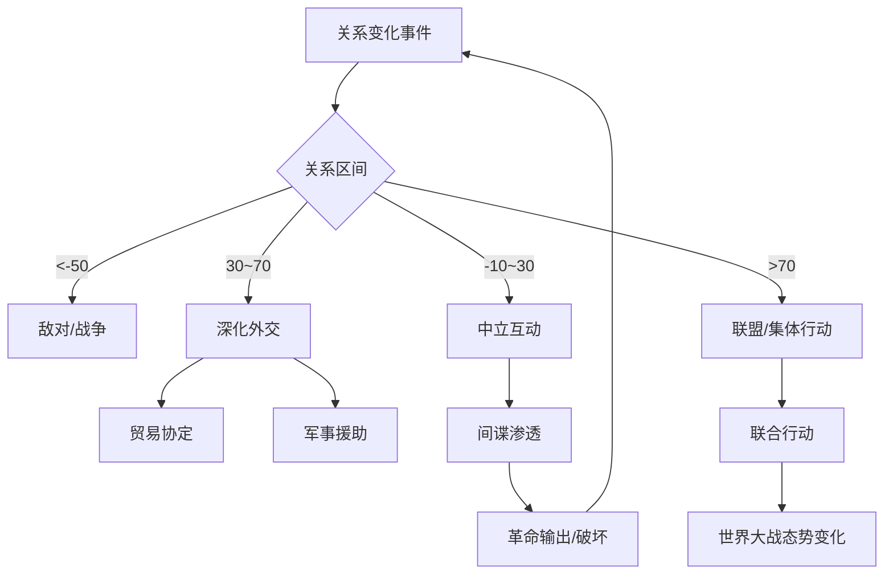

# 系统设计：外交与间谍

## 概述
外交系统是多国互动的核心。玩家通过联盟、贸易、援助与背叛塑造国际格局；间谍玩法提供情报与破坏渠道，为贫困国家提供非正面竞争的优势。

## 核心机制
1. **关系矩阵**：
   - 关系值范围 -100~+100：<-50 敌对，-50~-10 紧张，-10~30 中立，30~70 友好，>70 盟友潜力。
   - 影响因素：历史事件、意识形态差异、资源争夺、玩家行为。
2. **外交行动**：
   - 结盟：消耗外交点（每回合基础产出 3 点），关系≥60，可邀请 1~3 国。
   - 商贸协定：设置关税、交换资源与科技。协定周期 5 回合，可续签。
   - 军事援助：提供单位或军费，提升友好度 +15，但本国军费压力 +10%。
   - 宣战/停火：需消耗 2 回合政治准备时间，紧张度 >40 自动缩短准备时间。
   - 傀儡国：战争胜利后可建立，提供 20% 资源上缴与情报共享。
   - 国际会议：每 12 回合召开一次，投票通过条约或制裁。
3. **间谍活动**：
   - 情报网等级（0~5）影响任务成功率与可执行行动。
   - 可执行任务：窃取科技、破坏设施、煽动叛乱、暗杀将领、伪造条约。
   - 情报曝光风险：连续失败后被识破概率 +20%，导致关系 -25。
4. **意识形态输出**：
   - 每回合可对邻国投放宣传（消耗 5 宣传点），成功时影响力 +8、目标国稳定度 -4。
   - 革命输出需关系值 < -30，成功率受目标国稳定度与意识形态科技影响。

## 数值建议
- 外交点生成：基础 3 点/回合，外交部等级每级额外 +2。
- 间谍任务成功率：基础 45%，情报网每级 +8%，安保科技对方每级 -6%。
- 联盟维护成本：每位盟友每回合 20 资金，三方以上联盟额外 +15。
- 国际会议通过阈值：投票支持率 ≥ 66%，弃权视为反对。
- 革命输出冷却：成功后 6 回合冷却，失败后 4 回合并触发报复。

## 心理学考量
- **社交压力**：动态世界新闻和排行榜展示联盟演变，鼓励玩家参与外交。
- **复仇动机**：提供“复仇标记”系统，下次对战伤害 +10%，激发长期竞争。
- **不确定性**：间谍任务概率与事件随机性增强紧张感。
- **归属感**：联盟聊天与联合行动成就强化团队协作心理。

## 实现优先级
1. **P0**：关系矩阵、外交点与核心行动（结盟、贸易、宣战）。
2. **P0**：间谍任务基础执行与反馈界面。
3. **P1**：国际会议、傀儡国与意识形态输出。
4. **P2**：复仇标记、伪造条约等高级玩法。

## 外交流程图

