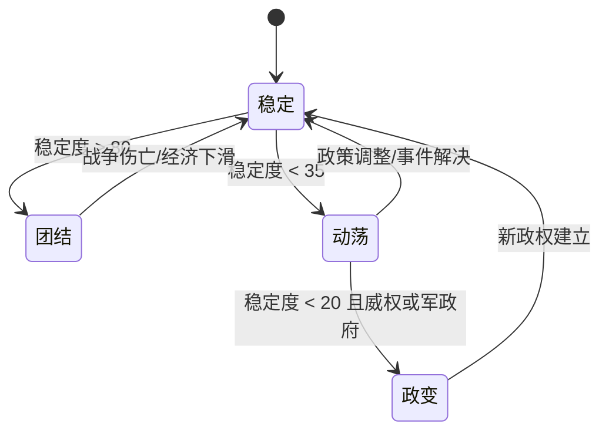

# 系统设计：内政与意识形态

## 概述
内政系统决定国家的治理效率、稳定度和意识形态方向。玩家通过政策、政体和社会管理维持国内秩序，同时为外交、科技与军事提供支撑。

## 核心机制
1. **稳定度与凝聚力**：
   - 指标范围 0~100，≥80 触发“团结状态”，<35 进入“动荡状态”。
   - 影响因素：经济、战争伤亡、政策、事件、宣传。
2. **政体类型**：
   - 民主、威权、军政府、神权四大类；各自提供独特加成与限制。
   - 政体转换需 4 回合准备，期间稳定度 -10。
3. **政策模块**：
   - 征兵（义务/志愿/精英）、经济（计划/混合/市场）、社会福利（高/中/低）、教育投入（低/中/高）、言论控制（开放/审查/严控）。
   - 每项政策调整有 2 回合冷却，变更后稳定度波动 ±6。
4. **意识形态轨迹**：
   - 自由民主、威权主义、共产主义、宗教原教旨四条轨迹，以意识形态点推进。
   - 不同轨迹影响外交倾向、国内事件与独特科技。
5. **社会事件**：
   - 罢工、示威、政变、改革、文化盛典等，根据稳定度与政策触发。
   - 贫困国家在动荡状态下革命概率 +10%，成功后可立即更换政体。

## 数值建议
- 城市满意度平均值 <60 时，总体稳定度每回合 -3。
- 战争伤亡每 1% 人口损失导致稳定度 -4，若宣传强度高可减至 -2。
- 政策成本：
   - 高社会福利：每回合 25 资金，稳定度 +8。
   - 高教育投入：每回合 20 资金，科技产出 +15%。
   - 严控言论：稳定度 +5，但外交声誉 -10。
- 政体加成例：
   - 民主：贸易收入 +12%，政策冷却 -1。
   - 威权：建设速度 +15%，但国际好感度 -8。
   - 军政府：军事生产 +20%，民生满意度 -10。
   - 神权：信仰影响力 +18%，科技速度 -8%。

## 心理学考量
- **掌控感**：通过仪表盘展示稳定度、满意度等实时数据，强化统治者角色感。
- **责任感**：社会事件以新闻形式呈现，引发玩家情绪共鸣，突出决策后果。
- **价值观共鸣**：意识形态选择配合叙事与美术，增强代入感。
- **损失厌恶**：政体转换或政策调整的代价显性化，促使慎重决策。

## 实现优先级
1. **P0**：稳定度核心公式、政策面板与政体基础效果。
2. **P0**：战争、经济对稳定度的实时反馈。
3. **P1**：意识形态轨迹与专属事件链。
4. **P1**：社会事件系统与新闻推送。
5. **P2**：领导人个性化特质与回放功能。

## 内政状态机

