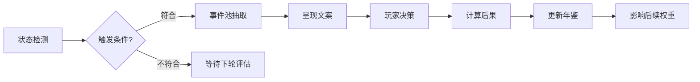

# 事件与叙事系统

## 概述
事件与叙事系统塑造全局张力和沉浸感，通过随机事件、关键决策与领袖故事构建动态世界。系统需兼顾可玩性与历史厚重感，让玩家在策略之余体验国家命运的情绪冲击。

## 核心机制
1. **事件分类**：
   - 随机事件：自然灾害、经济波动、民众运动、科技突破、国际突发。
   - 链式事件：工业化进程、革命、联盟会议、核竞赛。
   - 领袖事件：与统治者特质、决策相关的专属剧情。
2. **触发权重**：
   - 每 5 分钟评估一次，全局同时保持 2~4 个事件活跃。
   - 贫困国家在动荡状态下，社会事件权重 +25%。
3. **决策影响**：
   - 事件提供 2~3 个选项，影响资源、稳定度、声誉等多维指标。
   - 重大决策记录于国家年鉴，可回放并影响后续事件。
4. **叙事模板**：
   - 文案结构为“背景→冲突→选择→结果”，配合插画或新闻播报。
   - 关键事件配音或特殊音效，强调情感强度。
5. **战后叙事**：
   - 世界大战后触发“战后秩序”系列事件，包括战犯审判、经济重建、意识形态输出。

## 数值建议
- 事件冷却：同类型事件最短间隔 4 回合。
- 决策影响范围：资源 ±50、稳定度 ±15、国际声誉 ±20、科技进度 ±25%。
- 链式事件长度：3~5 步，完成奖励包括特殊将领、独特科技或全球声望。
- 年鉴容量：记录最近 12 次重大决策，可在结算时回顾。

## 心理学考量
- **叙事沉浸**：高质量文案与音画演出加强情感共鸣。
- **选择结果可视化**：决策后立即展示影响，让玩家感知因果关系。
- **逆境转机**：弱势国家事件提供风险中的希望，引导坚持与投入。
- **社交炫耀**：稀有事件与成就可在战后回放中展示，强化炫耀欲。

## 实现优先级
1. **P0**：事件触发引擎、权重系统与基础随机事件库（≥30 条）。
2. **P0**：事件 UI 与决策反馈。
3. **P1**：链式事件与年鉴系统。
4. **P1**：领袖特质事件与配套演出。
5. **P2**：战后纪录片式回放、语音包。

## 事件流程图

