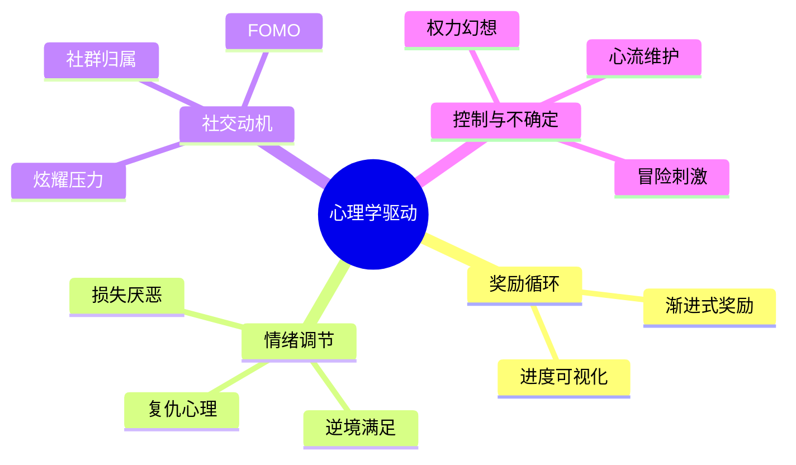

# 心理学机制设计

## 概述
围绕 12 条核心心理学原理构建玩家体验曲线，确保从短期目标到长期投入的完整动机链条。系统贯穿资源、外交、战争与叙事，使玩家在激烈对抗中保持心流并持续回归。

## 核心机制详述
1. **渐进式奖励**：
   - 短期（5~10 分钟）：完成资源任务、击败小股敌军获得 +10 经验、+5 资金。
   - 中期（30~60 分钟）：科技突破提供专属称号、全地图公告。
   - 长期（数小时）：世界大战胜利授予限时装饰与头像框。
2. **损失厌恶**：
   - 失守城市将触发“红色警报”演出，稳定度 -8，并弹出挽回任务。
   - 资源损失面板展示累计投入与沉没成本，提高玩家留存。
3. **逆境满足**：
   - 弱势国家逆袭时触发“荣耀时刻”动画，奖励复苏礼包（资源 +20%、科技进度 +10）。
4. **社交压力与炫耀**：
   - 多维排行榜（经济、军力、科技、意识形态），每 3 分钟刷新。
   - 战斗回放可分享，获得社交点赞积分。
5. **复仇心理**：
   - 被击败的玩家会获得“宿敌标记”，下次击败宿敌可得 +25% 战果积分。
6. **FOMO**：
   - 限时事件窗口 10 分钟，错过后需等待 20 分钟冷却。
   - 季节性科技每赛季更迭，提供独特兵种皮肤。
7. **叙事沉浸**：
   - 关键节点触发专属演讲与人民来信，增强情绪牵引。
8. **控制感与权力幻想**：
   - 地图染色与外交谈判 UI 强调玩家主导，核按钮需要双重确认仪式。
9. **不确定性与冒险**：
   - 间谍任务展示成功率区间（±8%），战斗存在 5% 暴击/失手机制。
10. **进度可视化**：
    - 国家发展仪表板以雷达图显示经济/军力/科技/外交/意识形态五维评分。
11. **心流维护**：
    - 难度动态调整，让 AI 根据玩家表现适度加强/减弱 10%。
    - 长时间建设阶段提供 2x/4x 加速选项。
12. **社群归属感**：
    - 意识形态阵营公共频道，完成阵营任务奖励阵营币。

## 数值建议
- 榜单刷新频率：180 秒；榜首奖励 +10 威望/回合。
- 社交点赞积分每 50 点可兑换限定旗帜。
- 复仇标记持续 3 局，失败后转化为“雪耻任务”。
- 心流提示：游戏 60 分钟弹出休息提醒，点击“稍后再说”延后 15 分钟。
- 阵营任务周期 24 小时，奖励 200 资源+阵营币 50。

## 心理学整合图

## 实现优先级
1. **P0**：奖励循环、进度可视化、复仇标记、排行榜。
2. **P1**：限时事件、阵营任务、阵营社交频道。
3. **P2**：高级演出（荣耀时刻、核打击仪式）、赛季主题内容。

## 心理学考量总结
- 通过频繁反馈与阶段性成就确保多巴胺释放节奏。
- 强化情绪波动（损失→补偿→逆袭）提升记忆点与分享率。
- 构建社交激励与竞争压力，提升玩家回流与黏性。
