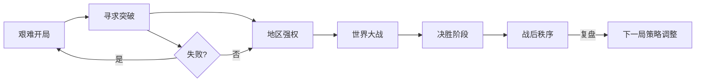

# 游戏流程设计

## 概述
游戏流程分为艰难开局、突破、地区强权、世界大战、决胜与战后秩序六个阶段，并提供闪电战、标准与史诗三种节奏模式。流程设计保证逆境玩家仍有翻盘机会，同时维持紧张感与节奏感。

## 阶段化流程
1. **艰难开局（0~15 分钟）**：
   - 重点任务：稳定国内、勘探资源、小规模冲突。
   - 关键指标：基础设施完成率 ≥ 60%，稳定度 ≥ 55。
2. **寻求突破（15~35 分钟）**：
   - 选择发展路径（经济/科技/军事），建立初步联盟或庇护。
   - 触发潜能任务与间谍活动。
3. **地区强权（35~60 分钟）**：
   - 完成地区统一或防御；外交评估进入中期。
   - 全球影响力排名进入前 3。
4. **世界大战（60~90 分钟）**：
   - 联盟结构大幅调整；世界威胁值 ≥ 70。
   - 大规模战役、核技术竞赛、经济战争同步展开。
5. **决胜阶段（90~120 分钟）**：
   - 决定性战役、核威慑、战略反击；胜利条件触手可及。
6. **战后秩序（120+ 分钟）**：
   - 重建、分赃、国际组织建立；结算与年鉴回顾。

## 模式时间建议
- **闪电战模式**：总时长 30~45 分钟，回合时间 30 秒，资源产出倍率 ×1.5。
- **标准模式**：总时长 60~120 分钟，回合时间 60 秒，资源产出倍率 ×1。
- **史诗模式**：总时长 180~240 分钟，回合时间 90 秒，资源产出倍率 ×0.8，事件密度增加 20%。

## 心理学考量
- **节奏递进**：难度与反馈逐步增强，维持心流体验。
- **紧迫感**：关键阶段通过警报、倒计时强化压力，促使快速决策。
- **恢复窗口**：阶段交替时提供补给/外交停战选项，防止疲劳。
- **社交互动**：世界大战与战后阶段增强联盟协作与炫耀需求。

## 实现优先级
1. **P0**：阶段判定逻辑、模式配置、关键任务目标。
2. **P0**：全局倒计时与威胁值驱动。
3. **P1**：阶段专属事件、奖励与演出。
4. **P1**：年鉴回放与战后统计面板。
5. **P2**：自定义模式、玩家自建剧本。

## 流程图

