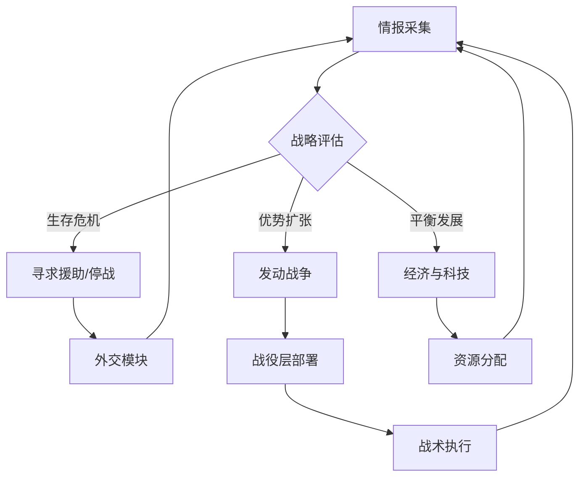

# AI 设计

## 概述
AI 需模拟真实国家行为，具备战略规划、外交博弈、战争指挥与逆境适应能力。目标是让 AI 看似“聪明但公平”，支持非对称开局与动态世界变化。

## 架构设计
1. **分层系统**：
   - 战略层：长周期规划（经济、科技、外交），更新周期 5 回合。
   - 战役层：战场部署与补给管理，更新周期 2 回合。
   - 战术层：即时战斗决策，回合内实时响应。
2. **状态机与规划器结合**：
   - 使用 Goal-Oriented Action Planning (GOAP) 处理高层目标，配合有限状态机管理战斗与外交态度。
3. **人格原型**：
   - 激进扩张、谨慎防御、科技超前、经济霸权、意识形态传播 5 类。
   - 每局随机赋予 2 个特性组合，影响优先级与风险偏好。
4. **非对称适应**：
   - 贫困开局 AI 优先游击战、间谍与国际援助。
   - 富裕开局 AI 注重联盟管理与防止围攻。
5. **动态难度**：
   - 根据玩家表现调整资源效率 ±10%、决策延迟 ±15%。
   - 触发条件：玩家领先指数（经济+军力+科技综合）≥20。

## 数值建议
- AI 思考预算：战略层 150ms、战役层 80ms、战术层 40ms/回合。
- 间谍成功率调整：人格激进 +10%，谨慎 -10%。
- 盟约履行概率：友好度 ≥70 时 90%，<40 时降至 45%。
- 核武器使用阈值：己方生存指数 <35 且敌方军力优势 >25%。
- AI 反应时间：史诗模式延迟 +20%，闪电战模式 -20%。

## 心理学考量
- **公平感**：AI 所有资源与加成公开显示，避免“作弊”印象。
- **挑战性**：人格化行为提供多样挑战，防止重复体验疲劳。
- **逆境激励**：贫困 AI 的顽强抵抗凸显玩家胜利价值，同时激励玩家学习其策略。
- **风险反馈**：AI 的大胆决策（如核威慑）配以戏剧化演出，增强紧迫感。

## 实现优先级
1. **P0**：分层架构、基本人格与核心目标（生存、发展、扩张）。
2. **P0**：战场补给与兵种克制逻辑。
3. **P1**：外交决策、联盟管理与背叛评估。
4. **P1**：动态难度调节与人格事件。
5. **P2**：AI 学习模块（基于玩家历史调整策略）、战报解说。

## AI 行为图

