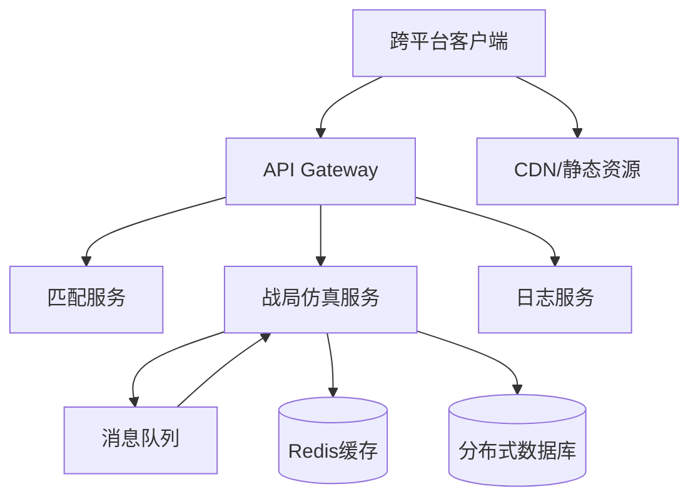

# 技术需求

## 概述
游戏需实现跨平台（PC+移动）体验，保证流畅性能、稳定网络与可扩展的前后端架构。技术方案围绕轻量化前端、弹性后端、实时同步与断线恢复展开。

## 核心技术要求
1. **前端架构**：
   - 使用 WebGL/Canvas 渲染混合方案，首包 < 5MB。
   - 资源按需加载，地图瓦片与单位模型采用分层缓存。
   - 响应式 UI 适配竖屏/横屏，移动端内存占用 < 150MB。
2. **网络同步**：
   - 异步回合制 + 实时战斗数据，采用 WebSocket + REST 混合通信。
   - 数据包大小控制：常规回合消息 ≤ 8KB，战斗回放数据压缩至 ≤ 20KB。
   - 断线重连：保留 3 分钟状态缓存，允许离线决策队列。
3. **服务器架构**：
   - 微服务 + 消息队列，支持水平扩展。
   - 仿真计算服务与匹配服务分离，使用 Redis 维护会话状态。
   - 峰值承载：并发 10,000 场战局，每场 6 人。
4. **存储与日志**：
   - 战局状态存储于分布式数据库（目标写入延迟 < 80ms）。
   - 战报、年鉴等冷数据定期归档至对象存储。
   - 关键操作全链路日志，满足合规与分析。
5. **性能优化**：
   - PC 60FPS、移动 30FPS；战斗演出允许降至 45FPS 并提供性能模式。
   - 流量消耗控制在 1MB/小时以内，通过 delta 压缩与差异同步实现。
6. **安全与公平**：
   - 数据通信全程加密，关键决策服务器校验。
   - 反外挂：客户端完整性检查、行为异常检测。

## 数值建议
- 客户端性能预算：逻辑主线程 < 10ms/frame，渲染 < 6ms/frame（PC），移动渲染 < 12ms/frame。
- 带宽预算：平均 20KB/min，峰值不超过 60KB/min。
- 服务器资源：单战局计算节点 2 vCPU + 4GB RAM 足量，预留 30% 弹性。
- API 响应目标：95p < 120ms，99p < 250ms。
- CDN 刷新周期：资源更新后 15 分钟内全球生效。

## 心理学考量
- **流畅体验**：低延迟与高帧率让玩家保持控制感与沉浸。
- **可靠性**：断线重连与状态回滚降低挫败感，提升信任。
- **透明度**：性能模式与网络状态提示增强掌控感，减少焦虑。
- **安全感**：反外挂反馈与公平说明提升玩家信心。

## 实现优先级
1. **P0**：基础网络框架、回合同步、断线重连。
2. **P0**：前端性能优化（资源加载、帧率控制）、响应式布局。
3. **P1**：日志体系、反外挂、战报归档。
4. **P1**：微服务拆分与自动伸缩策略。
5. **P2**：高级性能监控、热更新管线。

## 技术架构图

