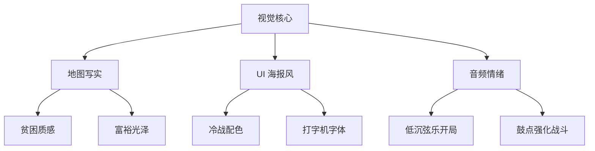

# 美术与叙事风格

## 概述
视觉与叙事风格结合写实与风格化，重塑世界大战的宏大与个人命运的对比。地图与单位趋向写实，UI 和事件插画采用冷战海报风格，强调张力与时代感。

## 视觉定位
1. **地图层级**：
   - 战略层：全球视角，采用真实地理投影，色彩饱和度中低。
   - 战术层：区域细节，以写实地形与光影强调战场氛围。
   - 战争迷雾：半透明粒子与动态线条表示未知区域。
2. **单位与建筑**：
   - 模型采用卡通渲染+细节贴图，兼顾辨识度与轻量化。
   - 贫困国家单位颜色偏灰、材质粗糙；富裕国家使用光泽金属与鲜亮色块。
3. **UI 设计**：
   - 主色调为深蓝+红橙对比，突出冷战紧张感。
   - 字体选用无衬线与打字机风格混搭，区分信息类型。
4. **事件插画**：
   - 运用海报式构图、大面积色块与强烈对比光影。
   - 关键事件配合手绘质感笔刷，突显历史厚重感。

## 音频与叙事
1. **音乐层次**：
   - 开局：低沉弦乐+民族乐器，营造困境。
   - 战争：加入鼓点与铜管，节奏提升 20%。
   - 决胜：混合合唱与合成器，营造史诗感。
2. **音效**：
   - 战斗音效根据地形与兵种差异化处理。
   - 核威慑与荣耀时刻设置专属音效，长度 8~12 秒。
3. **语音**：
   - 关键领袖演讲使用多语言配音，长度控制在 25~40 秒。

## 数值建议
- 事件插画制作周期：每张 3 天，首发需 40 张。
- UI 动效帧率：60FPS（PC），移动端降至 45FPS。
- 音乐循环长度：普通阶段 4 分钟，战斗主题 2 分钟。
- 资源包体：
   - 单张插画 < 250KB（WebP）。
   - 单个单位模型 < 150KB，贴图 512x512。
- PBR 级别：采用简化金属度/粗糙度贴图，移动端加载 50% 解析度。

## 心理学考量
- **对比叙事**：贫困与繁荣视觉差异强化逆袭感。
- **情绪联动**：音乐与音效节奏随战局变化，调节紧张与释放。
- **代入感**：领袖语音及群众反应声营造统治者责任感。
- **记忆点**：海报风插画易于传播与分享，提高玩家回忆与讨论度。

## 实现优先级
1. **P0**：地图风格设定、UI 规范、基础单位美术包。
2. **P0**：战斗音效与关键音乐主题制作。
3. **P1**：事件插画库与核威慑演出特效。
4. **P1**：多语言配音与领袖演讲。
5. **P2**：皮肤系统、赛季主题视觉与动态背景。

## 风格参考图

